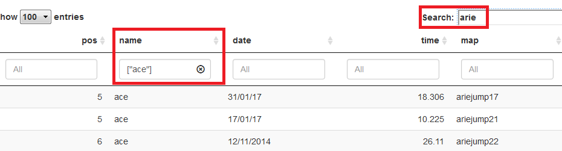
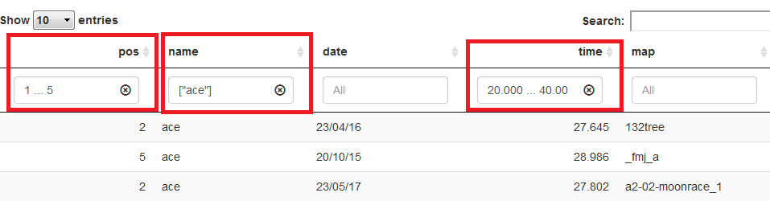

### About

I decided to make an easier way to view maptimes, and sort them the way you want to. I'll try to update the data source every few weeks, as it can't pull directly from the site. 

You can find the up to date stats [here.](http://195.93.242.155/~quake2/quake2/jump/_html/_index1.html)

***
***
***

### Example 1

As a quick example, if you want to view your own times, on only arie maps, you can do so by filtering like this. You can then export the data by clicking copy, or directly downloading the csv file for use in excel.

***
***
***

### Example 2

If you want to view times set by you that are greater than 20 seconds, but less than 40 seconds, and at least a top 5, you can do this:

